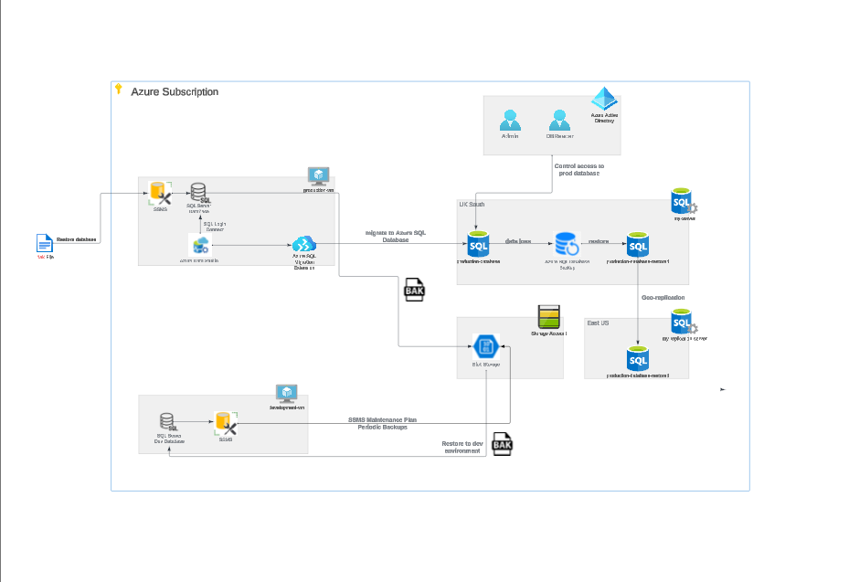

# Azure Database Migration
## Overview
This project documents the step-by-step process of how to architect and implement a cloud-based database system on Microsoft Azure. This, in breif, will include migrating a local database to Azure, implementing the appropriate data protection measures and simulating a disaster recovery scenario.

## Contents:
1. [Provisioning a Production Environment & Database](#1-provisioning-a-production-environment--database)
2. [Migrating Database To Azure](#2-migrating-database-to-azure)
3. [Data Back-Up And Restoration](#3-data-back-up-and-restoration)
4. [Disaster Recovery Simulation](#4-disaster-recovery-simulation)
5. [Geo Replication And Failover](#5-geo-replication-and-failover)
6. [Microsoft Entra Intergration](#6-microsoft-entra-intergration)
7. [Conclusion](#7-conclusion)
8. [UML](#8-uml)
9. [License](#license)

## 1. Provisioning a Production Environment & Database
### Prerequisites:
- Microsoft Azure account
- Backup file (```.bak```) for the production database


### VM Setup And Installing SQL Server & SSMS:
1. An Azure Virtual Machine(VM) was provisioned with windows 11 OS and adequate computing power for general use
2. Now connected to the VM, SQL Server and SQL Server Managment Studio(SSMS) were installed:
    - Download SQL Server [download wizard](https://go.microsoft.com/fwlink/p/?linkid=2215158&clcid=0x809&culture=en-gb&country=gb)
3. Thanks to using a windows OS the only firewall rule required is enabling RDP (Remote Desktop Protocol) Access

### Production Database:
1. A production database was generated in SSMS
2. The ```.bak``` file was used to restore the database for use as the production. In this case the Microsoft AdventureWorks database was used

### Insights:
- The Azure VM's are useful ways to provide a secure and uncluttered work envioment. A windows OS was used for its compatibility with all the other microsoft tools used in this project (i.e Azure, SSMS and Data Studio). Additionally, only RDP Access firewall rule is required for access to the VM

- A general purpose size VM is adequate for this to balance cost with performace.

- SQL Server and SSMS are powerful tools for managment of a database allowing convenient features for security and querying


## 2. Migrating Database To Azure
### Prerequisites
1. Connect to Production-VM
2. Install Azure Data Studio with:
    -  "SQL Server Schema Compare" Extension
    - "Azure SQL Migration" Extension

### Setup 
1. First an Azure SQL Database is required
2. Connect to the Azure database and Local datbase Ensuring SQL Authentication is used
3. Compare Schema with the extension and and apply all changes
4. Migrate using the extension and follow the 
5. Test successful migration by querying the Azure database. For example, select top 1000 rows of any table

### Insights
- Azure data studio provides a straighforward way to migrate an on-premise database to the cloud allowing for the security and redundancy benefits that entails.

## 3. Data Back-Up And Restoration
### Prerequisites 
1. Development enviroment VM
2. Azure blob storage and container

### Setup
1. Backup On-Premise database using SSMS
2. Upload to a provisioned Azure blob storage 
3. A Development virtual machine(Dev-VM) was provisoned with the same specifications as the production VM with SQL Server and SSMS following the same steps as in [Part 1](#1-provisioning-a-production-environment--database)
4. Restore the backup file to the Dev-VM's SSMS from the Azure blob storage
5. Weekly Back-ups were automated with the built-in Maintenance Plans wizard is SSMS

### Insights
- Creating a seperate server on a Dev-VM allows for develpment and alteration of the database without affecting the production database until the changes are ready to be implemnted. This allows for minimal down time of the production database.

- Automating a back-up plan is essential for responsible database managment and removes the need for manual backing up in normal circumstances

## 4. Disaster Recovery Simulation
### Disaster Simulation
1. An initial corruption of the data was first introduced
```sql
-- Intentional Deletion
DELETE TOP (100)
FROM HumanResources.EmployeePayHistory

-- Data Corruption
UPDATE TOP (100) HumanResources.EmployeePayHistory
SET ModifiedDate = 1;
```

- The first SQL block deletes vital information from the production database, and the second corrupts the data with false information. 

2. This simulated disaster can be confirmed by running a SQL query with the top 1000 rows feature which runs this script:

```sql
SELECT TOP (1000) [BusinessEntityID]
      ,[RateChangeDate]
      ,[Rate]
      ,[PayFrequency]
      ,[ModifiedDate]
  FROM [HumanResources].[EmployeePayHistory]
```

### Recovery Simulation

1. A backup was restored from the Azure SQL Database backup feature
2. The backup was from 2 hours prior to ensure it was before the corruption but not excessively long before
3. This was tested by selecting the top 1000 rows script like before
4. Once the restoration was verified the corrupted database was deleted 

### Insights
This process demonstrated the power of azure servies for data security and recovery.

## 5. Geo Replication And Failover
### Geo Replication
1. A Replication server was created in a seperate geographical region 
2. In this case the the database was replicated to a US-East server


### Failover Test 
1. A planned failover to the secondary region was simulated by transitioning operations to the secondary server. 
2. The availability and data consistency of the failover database was tested by connecting to the geo-replica in azure data studio.
3. Afterward a failback to the primary region was performed completing the failover strategy cycle.

### Insights
- Geo-replication is essential if a high level of database protection and security is required. It can protect a database from disastrous events in a region.
- This shows the saftey features of Azure again for even the most extreme circumstances

## 6. Microsoft Entra Intergration
### Admin User
1. Microsoft Entra was enabled on the SQL Server that hosts the production database
2. An Admin user was setup and used to connect to the azure database in data studio using Microsoft Entra authentication

### DB Reader User
1. This process was repeated but for a user with the ```db_datareader``` role
2. Run the following script to add this role as a reader to the database
    ```sql 
    CREATE USER [DB_Reader@yourdomain.com] FROM EXTERNAL PROVIDER;
    ALTER ROLE db_datareader ADD MEMBER [DB_Reader@yourdomain.com];
    ```
3. This role was tested. Connected to the database as the DB Reader, a query was run to read data which should be successful and then a query to delete data was ran which is denied


### Insights 
- Integrating Microsoft Entra ID with Azure SQL Database provides a more secure and manageable way to authenticate users and applications, eliminating the need for storing database credentials. 
- It provides granular access control aiding in security which can protect data from accidental or malicious deletion or corruption.

## 7. Conclusion
The primary takeaways from this project is the ease of use of Azure services and the security and data protection it provides. 

## 8. UML



### License:
No License
